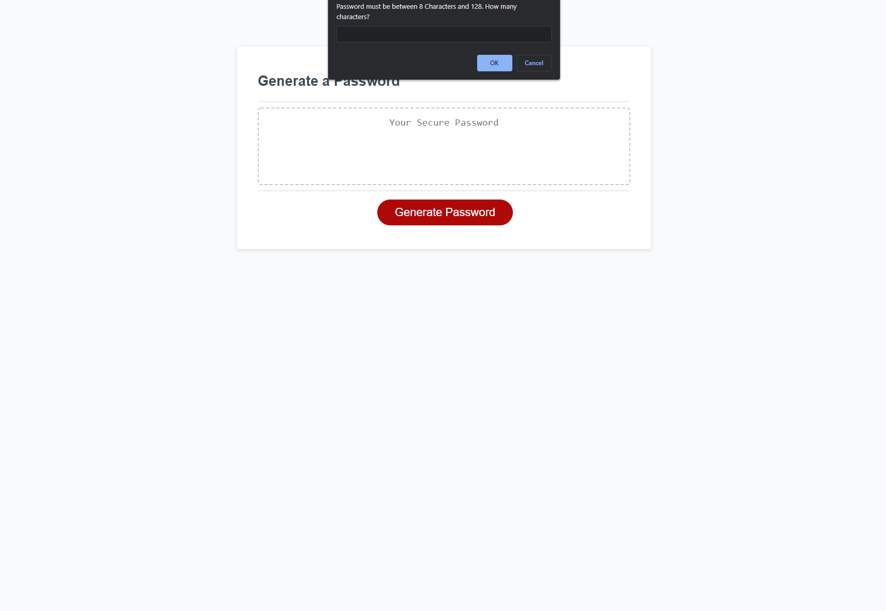

# cool-password-generator

Password generator - a password generator that will take a users input and generate a random password

# Description

This project is a random password generator. It offers a simple a nice user experience, when the generate button is pressed it will ask the user to choose a length between 8 and 128 characters long. Then it will ask if you would like to choose lower case, uppercase, numbers, and special characters as the password criteria. One must be selected in order to continue. Once one is selected in the confirm prompt a randomly generated password will appear in the password box on the page. To run locally download the or clone the repository and open the index.html file.

# Screenshot

# Link to Deployed App

https://jordanb366.github.io/cool-password-generator/
